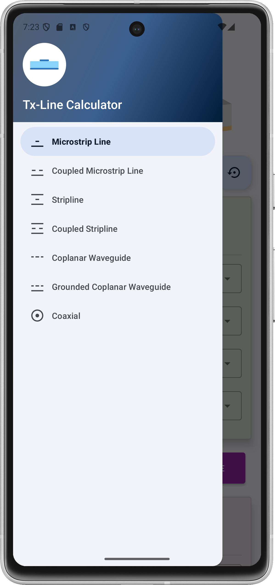
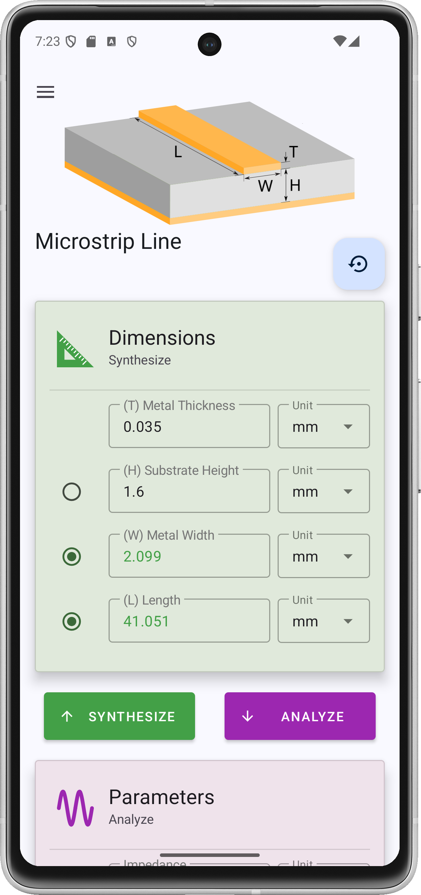
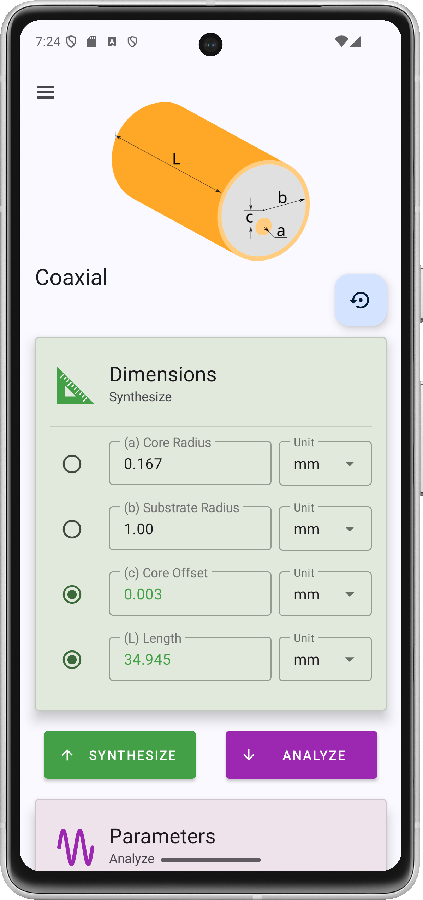
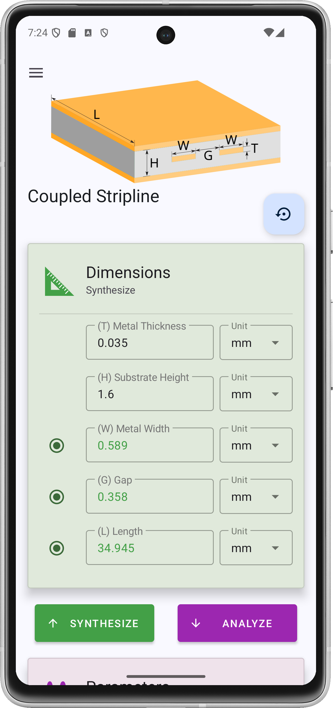
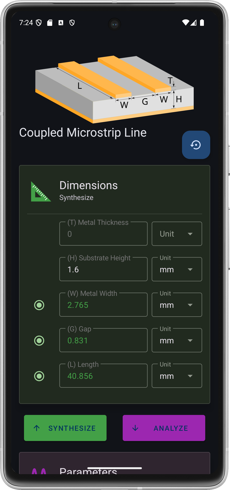

</a>

# Tx-Line Calculator

<a href="https://play.google.com/store/apps/details?id=com.rookiedev.microwavetools"></a>

A transmission line calculator for RF/microwave engineers.

## Background

This project started as a part-time hobby during my undergraduate studies. I was taking an RF/Microwave circuits course at the time, and Android was just emerging as a mobile platform. It was a natural exercise to combine what I was learning in class — transmission line theory and microwave circuit design — with the challenge of building an Android app from scratch.

The project has been kept alive and occasionally updated ever since.

## Features

- **Analyze** mode: calculate electrical parameters from physical dimensions
- **Synthesize** mode: calculate physical dimensions from electrical parameters

## Supported Transmission Lines

- Microstrip Line
- Coupled Microstrip Line
- Stripline
- Coupled Stripline
- Coplanar Waveguide
- Grounded Coplanar Waveguide
- Coaxial

## Requirements

- Android 11 (API level 30) or higher
- Java 17

## Screenshots

</a>
</a>
</a>
</a>
</a>

## License

This project is licensed under the GNU General Public License v3.0. See the [LICENSE](LICENSE) file for details.

## Building the Project

This project requires the Android SDK and Java 17. Build using the Gradle wrapper scripts provided:

```sh
./gradlew build
```

On Windows, use:

```sh
gradlew.bat build
```
