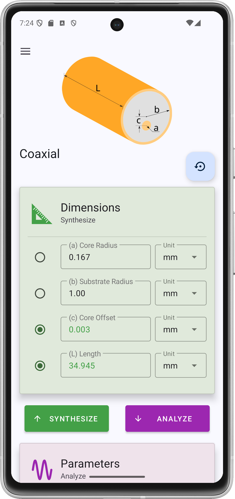

</a>

# Tx-Line Calculator

<a href="https://play.google.com/store/apps/details?id=com.rookiedev.microwavetools"></a>

A transmission line calculator for RF/microwave engineers.

## Supported Transmission Lines

- Microstrip Line
- Coupled Microstrip Line
- Stripline
- Coupled Stripline
- Coplanar Waveguide
- Grounded Coplanar Waveguide
- Coaxial

## Screenshots

</a>
</a>
</a>
</a>
</a>
[Screen_recording_20241227_192134.webm](https://github.com/user-attachments/assets/6c0b4a1f-5aaf-4ef9-a42c-cf33fbdf6328)

## License

This project is licensed under the GNU General Public License v3.0. See the [LICENSE](LICENSE) file for details.

## Building the Project

To build this project, use the Gradle wrapper scripts provided:

```sh
./gradlew build
```

On Windows, use:

```sh
gradlew.bat build
```
